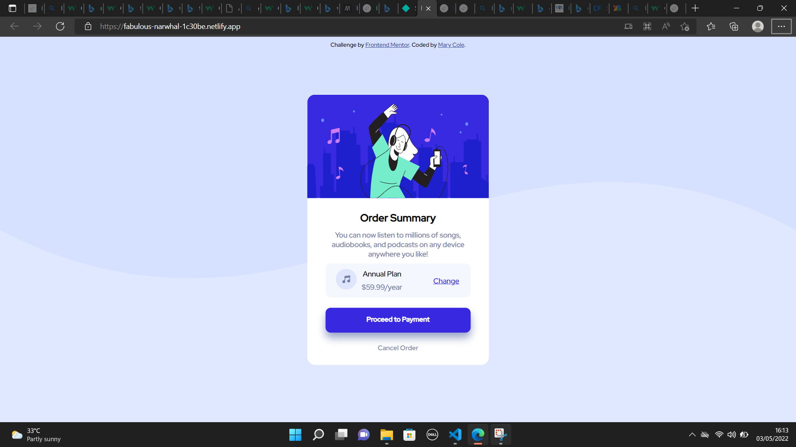

# Frontend Mentor - Order summary card solution

## Table of contents

- [Overview](#overview)
  - [The challenge](#the-challenge)
  - [Screenshot](#screenshot)
  - [Links](#links)
- [My process](#my-process)
  - [Built with](#built-with)
  - [What I learned](#what-i-learned)
  - [Continued development](#continued-development)
  - [Useful resources](#useful-resources)
- [Author](#author)

## Overview

### The challenge

Users should be able to:

- See hover states for interactive elements

### Screenshot



### Links

- Live Site URL: (https://fabulous-narwhal-1c30be.netlify.app/)


## My process

### Built with

- Semantic HTML5 markup
- CSS custom properties
- Flexbox
- Mobile-first workflow

### What I learned

```css
#child4 {
  box-shadow: 0 10px 1.2em hsl(226, 29%, 69%); 
}
```
### Continued development

- Use of the '*' selector
- Row and column gaps in flexbox
- Media queries
- Box-shadow

### Useful resources

- [Example resource 1](https://www.w3schools.com/css/css3_shadows_box.asp#) - This helped me understand how box-shadow can be applied in css


## Author

- Website - [Mary Cole](https://fabulous-narwhal-1c30be.netlify.app/)
- Frontend Mentor - [@adebimpecole](https://www.frontendmentor.io/profile/adebimpecole)
- Twitter - [@adecole02](https://twitter.com/adecole02)